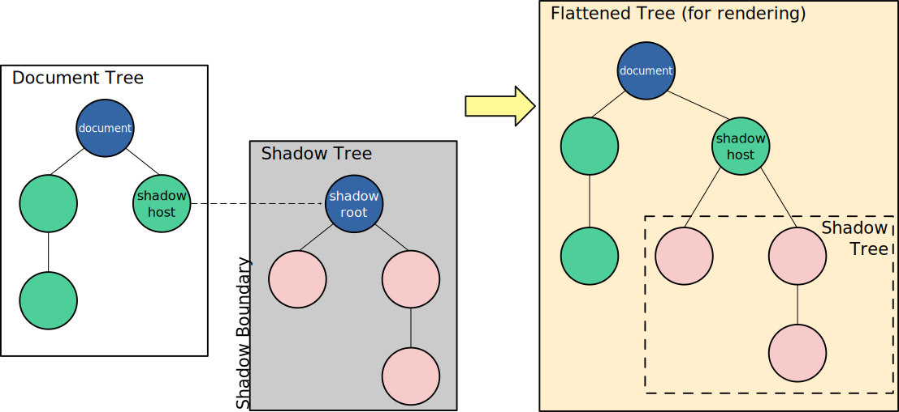

# Research about Shadow DOM

The Shadow DOM is a standard web API that allows to attach an isolated, hidden DOM tree inside a standard html element. This with the purpose of encapsulating the styles and logic inside the shadow tree.

A shadow DOM has the following concepts/parts:
 - Shadow host: the element where the shadow tree is linked to.
 - Shadow tree: the DOM tree with the elements inside the Shadow boundary.
 - Shadow boundary: the group of elements that are hidden/encapsulated.
 - Shadow root: The starting node of the shadow tree.

The elements isnide the shadow tree won't be reachable by methods like "document.querySelectAll()". To reach them, it will only be possible through the shadow host property "shadowRoot", only if the shadow DOM was created as "open". If the shadow DOM is created as "closed", the shadowRoot will evaluate as null.

## 3 Common uses

1. UI component libraries
2. Embedded Elements
3. Micro frontend architecture

## Presentation

Link to presentation: [Shadow DOM Canva Presentation](https://canva.link/x8rww5sbjh2xm26)

## Metodology

To fulfill this task, I did a combination of research documentation and prompting LLMs (Gemini)

Documentation researched: [Official MDN docs](https://developer.mozilla.org/en-US/docs/Web/API/Web_components/Using_shadow_DOM#element.shadowroot_and_the_mode_option)

First prompt:

> _"What is the Shadow DOM?"_

 Gemini answered with a simplified definition of a Shadow DOM being a standard web api, some basic details and a simple example.

Second prompt:

> _"What are common uses for the Shadow DOM?"_

Gemini answered with some examples that are mentioned on this file and the presentation
