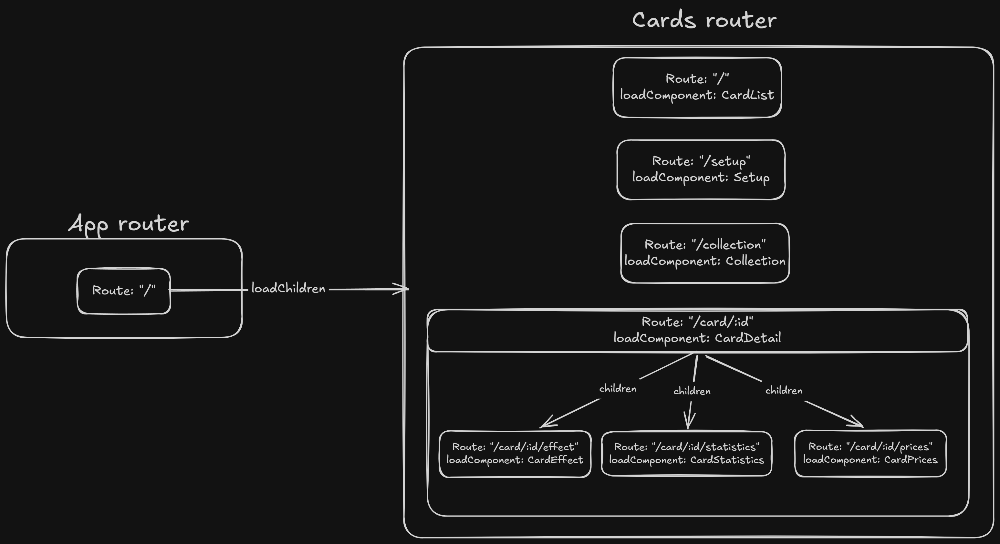

# DuelistCodex

## CHALLENGE 1

### HU-01 — Ver catálogo de cartas

> Como duelista que abre la aplicación, quiero ver una grilla con las cartas disponibles, incluyendo su imagen, nombre y tipo, para poder explorar el catálogo general antes de buscar algo específico. **Criterios de aceptación**:
> * Al cargar la vista principal se muestra un conjunto de cartas obtenidas desde la API de YGOPRODeck.
> * Cada carta en la grilla muestra al menos su imagen, nombre y tipo.
> * Si por alguna razón no hay cartas para mostrar, la persona usuaria ve un mensaje claro en vez de una pantalla en blanco.
> * Mientras los datos se están cargando, hay alguna señal visual de que la app está trabajando (no una pantalla congelada o vacía sin explicación).


For the first User Story, I created a Layout component divided in 3: Header, Main and Footer.

The Header will contain the title and search bar, the Main will contain a "card grid" and the Footer will contain the pagination.

I want card-slot component to be "dumb", which means only show UI, the one that will get the data on the initial load with ngOnInit and pass to it will be the card-grid.

I also added a pagination component, which interacts with the query params available on the API. At first I was doing a "local" pagination but knowing that the API offers query params to do pagination, I will use them.

Tasks:
- [x] Bring api data
	- [x] Create service
	- [x] Test bringing data
- [x] Render single card
- [x] Render card grid
- [x] Render empty grid message
- [x] Render loading message/icon
- [x] Add pagination using the API query params

### HU-02 — Buscar cartas por nombre
> Como duelista, quiero escribir el nombre (total o parcial) de una carta y obtener los resultados que coincidan, para encontrar rápidamente la carta que quiero revisar sin recorrer todo el catálogo.
**Criterios de aceptación**:
> * Existe un campo de búsqueda visible y accesible desde la pantalla principal.
> * Al buscar, la aplicación consulta la API con el término ingresado y actualiza el catálogo mostrado con los resultados.
> * Si la búsqueda no encuentra ninguna carta, se informa explícitamente en vez de mostrar una grilla vacía sin contexto.
> * Al entrar a la pantalla, el campo de búsqueda queda listo para que la persona usuaria empiece a escribir de inmediato, sin pasos adicionales.

For this step, I decided to separate the search component (it was inside the layout) so the layout reamins clean of logic. Also, the AI recommended using the service also the centralize the search value so even search-bar and card-grid are siblings, I don't need to create a state on layout that is shared and drilled to the children, the shared state will live on the service and will be injected on the grid and search bar components.

After some analysis, the logic was re arranged and moved to the cards service completely, so now inside the card service all the fetching and filtering is done, besides the change detection, and card-grid and card-slot remain "dumb". Now the initail data load is done on the service **contructor** and the data is refetched every time the page or the search term changes.

- [x] Create the search-bar component
- [x] Add "searchValue" signal to be shared for search-bar to update value and grid to show result

### HU-03 — Ver el detalle de una carta
>Como duelista, quiero seleccionar una carta del catálogo y ver toda su información (efecto, ATK/DEF, tipo, atributo), para decidir si la carta me interesa para un futuro mazo. Criterios de aceptación:
> * Al seleccionar una carta desde el catálogo, se muestra una vista de detalle con su información completa provista por la API.
> * La vista de detalle indica claramente a qué carta corresponde (imagen y nombre visibles).
> * La persona usuaria puede volver del detalle al catálogo sin perder el contexto de su búsqueda anterior (ej. el término buscado sigue ahí).

For User Story 3, I will create a modal that shows the details, so that is not necessary to create a new view and is easy to go back and forth from all the cards results and their details. For this, a 'selectedCard' signal was created on the service for two things: 

1. If is null, the modal is closed; if there's data, the modal is open.
2. To pass the data tot the modal component. 

The signal is set when a card-slot component is clicked (which assigns the cardInfo to the signal), and is set again to null when the modal is closed. Also, in order for card-slot to remain as clean as possible, only an output was set as "cardClick", so that this component can remain as clean as possible and could be reused on the future.

- [x] Create modal component with its basic layout
- [x] Make the card-slot component clickable so it opens the modal and pass it the data of that card

### HU-04 — Organizar el detalle en secciones
> Como duelista, quiero que la información de esa vista de detalle (la de HU-03) esté organizada en secciones — por ejemplo su efecto, sus estadísticas y su precio de referencia — en lugar de un solo bloque de texto, para no sentirme abrumado por un bloque enorme de texto y datos mezclados. Criterios de aceptación:
> * La información de la carta en el detalle está organizada en secciones o bloques claramente diferenciados (por ejemplo: Efecto, Estadísticas, Precio).
> * La persona usuaria puede identificar y acceder a cada sección de forma independiente (pestañas, acordeón, o el mecanismo que el estudiante elija).
> * El componente que organiza estas secciones está diseñado para ser reutilizable: no debería depender de que el contenido sea específicamente 'cartas de Yu-Gi-Oh'.

For this user story, the idea is just simply expand the card-detail-modal component so it is divided in sections. Tabs can be implemented as buttons that set which tab is active. For this, I used 2 signals and one output: one to track the active tab, one to have all the tabs value and the output to set the new activeTab value. Also for this I used ng-content, so that the tabs are rendered independent of the content, and this way it will be reusable.

### HU-05 — Mantener el estado de búsqueda de forma consistente
> Como duelista, quiero que la aplicación recuerde de forma consistente qué estoy buscando (HU-02), si hay una carga en curso (HU-01), y qué carta tengo seleccionada (HU-03), para tener una experiencia fluida sin resultados inconsistentes o pantallas que 'parpadean'. Criterios de aceptación:
> * El estado de la búsqueda (término, resultados, carga, error) se maneja de forma centralizada y explícita, no con variables sueltas repetidas en varios componentes.
> * El estudiante elige una única herramienta para este manejo de estado —BehaviorSubject o Signals— y la aplica de forma consistente en toda la funcionalidad de búsqueda.
> * En la presentación, el estudiante explica por qué eligió esa herramienta para este caso puntual (qué ventaja le vio frente a la alternativa).

This user story was working implicitly on previous tasks. All the necessary states/variables for searching/filtering/pagination are on the CardService. And about the second point, Signas was the choice for 2 particular reasons:

1. According to what I researched, BehaviorSubject are used better for async operations, and the only part where we are doing async is on the CardService when fetching the API, and for this we use httpClient which returns an Observable.
2. Signlas is the modern and simpler way to manage states on Angular, and it works really well for reactivity and optimizing which changes affect which componets, so the observability is very localized.

Some other final decisions: 
* remove the footer from the layout, it was not necessary.
* In the end, the initial load stays on the **ngOnInit** of the card grid component instead of the service's constructor. Makes more sense to call it when the component is actually initialized.

## CHALLENGE 2

### Routes map - diagram

The root route (`app.routes.ts`) does nothing but lazy load the cards feature (`CARDS_ROUTES`), so the whole app hangs from one feature module. Every page is lazy loaded with `loadComponent`, the card detail is a parent route with 3 lazy children (one per tab), and `/collection` is protected by `usernameGuard`.



Every request goes to the same YGOPRODeck endpoint, `GET https://db.ygoprodeck.com/api/v7/cardinfo.php`, and all of them live in `CardsService`. What changes between calls are the query params:

| Method | Query params sent | Used by | What it is for |
| --- | --- | --- | --- |
| `fetchCards()` | `num=12`, `offset=(page-1)*12` | `/` (catalog grid + pagination) | Paginated catalog. `num` + `offset` is what makes the API return the `meta.total_pages` used by the pagination component |
| `fetchCards()` (searching) | `num=12`, `offset=…`, `fname=<term>` | `/` (search bar) | `fname` is the *fuzzy* name search, so partial names match. It is only added when the term is not empty, and the page resets to 1 |
| `getCardById(id)` | `id=<id>` | `cardResolver` → `/card/:id` | Single card for the detail route. Response is `data[0]`, or `null` if it fails |
| `getCardsByIds(ids)` | `id=<id,id,id>` | `/collection` | The same `id` param accepts a comma separated list, so the whole favorites collection is fetched in one request instead of N |

Notes about the API:

* `cardinfo.php` returns `400` when nothing matches (for example an `fname` with no results), so both `fetchCards()` and the getters have a `catchError` that falls back to an empty list / `null` instead of letting the error reach the UI.
* `meta.total_pages` only comes back when the request is paginated with `num`/`offset`, which is why `totalPages` defaults to `1`.
* `getCardsByIds([])` short circuits with `of([])` and never calls the API, because sending an empty `id` would be a bad request.

Some decisions worth noting:

* The card detail stopped being a modal (HU-03) and became a real route, so a card is now shareable/bookmarkable by URL and the tabs of HU-04 became child routes instead of signals.
* `cardResolver` fetches the card **before** activating the route, so `CardDetail` never renders a half empty view while the request is in flight.
* `usernameGuard` returns a `UrlTree` instead of calling `router.navigate`, which is the recommended way: the redirect is part of the same navigation and the guard stays free of side effects. It carries `returnUrl` so after the setup form the user lands back where they wanted to go.
* `withRouterConfig({ paramsInheritanceStrategy: 'always' })` is enabled so the child tab routes can read the `:id` param and the resolved `card` from the parent.

## CHALLENGE 3

### Search and filter criteria

The catalog can now be narrowed by three criteria that work independently or combined. All of them are resolved **by the API**, not in the browser: filtering the 12 cards of the current page locally would have been a bug as soon as pagination is involved.

| Criteria | UI control | Signal in `CardsService` | API param | Notes |
| --- | --- | --- | --- | --- |
| Name | Text input (autofocused) | `searchValue` | `fname` | Fuzzy search, so partial names match. Debounced 400 ms |
| Card type | `All types` dropdown, single choice | `typeFilter` | `type` | 10 values (`Effect Monster`, `Spell Card`, `Trap Card`, …) from `CARD_TYPES` |
| Attribute | Custom dropdown with checkboxes, **multiple choice** | `attributeFilters` | `attribute` | 7 values (`DARK`, `LIGHT`, `EARTH`, `WATER`, `FIRE`, `WIND`, `DIVINE`) from `CARD_ATTRIBUTES` |

An empty criteria means the param is simply not sent, so clearing everything returns to the general catalog instead of an error. A `Clear filters` button appears whenever at least one criteria is active.

The API guide documents that `attribute` accepts a comma separated list, and it behaves as an **OR**: `attribute=DARK` returns 2698 cards, `attribute=DARK,LIGHT` returns 4666. So the attribute filter keeps a `string[]` signal and joins it with commas when building the params, which means one request no matter how many attributes are ticked.

A native `<select multiple>` was not an option because it needs ctrl/cmd+click and shows no checkboxes, so the control is a button plus a panel of checkboxes. The panel closes on outside click or `Escape` (both wired through the component `host`), and the button label collapses to `All attributes` / the attribute name / `N attributes` depending on how many are selected.

The three criteria are combined in **one** place, a `computed()` in `CardsService`:

```ts
readonly #criteria = computed<SearchCriteria>(() => ({
	fname: this.#debouncedSearch(),
	type: this.typeFilter(),
	attribute: this.attributeFilters().join(','),
}))
```

`httpResource` reads that object and spreads in only the non-empty entries, so every filter handler in the search bar is a one line `.set()` and no component builds query params itself. I chose `computed()` over `combineLatest` here because the three sources are already signals — using RxJS would have meant converting them out and back for nothing. The RxJS interop is used where it actually pays off, which is the debounce.

### Endpoints and parameters

Everything still goes to a single endpoint, `GET https://db.ygoprodeck.com/api/v7/cardinfo.php`. This table replaces the Challenge 2 one, since `fetchCards()` no longer exists:

| Caller | Query params sent | Used by | What it is for |
| --- | --- | --- | --- |
| `#cardsResource` (`httpResource`) | `num=12`, `offset=(page-1)*12`, plus `fname` / `type` / `attribute=<a,a,a>` when active | `/` (grid, search bar, filters, pagination) | The catalog. Re-fetches by itself whenever any of the signals it reads changes |
| `getCardById(id)` | `id=<id>` | `cardResolver` → `/card/:id` | Single card for the detail route. Stays on `HttpClient` because a resolver needs a one shot Observable |
| `getCardsByIds(ids)` | `id=<id,id,id>` | `/collection` | The `id` param takes a comma separated list, so the whole favorites collection is one request instead of N |

### How the reactive chain is wired

1. Typing updates `searchValue` on every keystroke.
2. `toObservable → debounceTime(400) → distinctUntilChanged → toSignal` turns that into `#debouncedSearch`, so the API is not hit per keystroke.
3. `#criteria` combines it with the two dropdown signals.
4. `currentPage` is a `linkedSignal` **sourced from `#criteria`**, so any change of criteria resets to page 1. It is not a `computed()` because the pagination still has to write to it. Without this, filtering while on page 4 would request `offset=36` of a result set that may only have 5 cards.
5. `httpResource` rebuilds its request from `#criteria` + `currentPage` and exposes `isLoading()`, `error()` and `value()`, which the grid renders directly. No more manual `loading` signal or `.subscribe()`.

### API quirks handled by the interceptor

`cardinfo.php` answers **`400`** when a query has no matches (body: `{"error":"No card matching your query was found..."}`), which is a success case dressed as an error. `errorInterceptor` translates that single case into an empty `200` response and rethrows everything else as an `Error` with a readable message:

* status `0` → "We couldn't reach the card database…"
* status `5xx` → "The card database is not responding right now…"

Two consequences worth pointing out:

* Rethrowing (instead of swallowing) is what lets `httpResource` populate its `error()` state. Returning a fallback value would make the resource look successful and the error branch of the template would never run.
* Some filter combinations are impossible by design — `type=Spell Card` + `attribute=DARK`, since spells have no attribute. The API answers `400`, the interceptor turns it into an empty result, and the grid shows "No cards match your search" instead of an error. That criteria of HU-04 is satisfied by the error handling built for HU-02.

### Why focused card uses signal instead of computed or linkedSignal

The concept of having a focused card is that this will be a selected card that is shown besides the card grid, independent of what happens, whereas I make a new search, add filters, or change page, the focused card should remain intact. Because of this, the state that holds the focused card shouldn't depend of what happend outside it, except for user interaction with the options of toggle focus or clear focus.

Knowing this, using computed or linkedSignal doesn't sound like a good idea, because there shouldn't be another state that the focused card depends on. 

A use case where linkedSignal can help more is on the pagination, because if I'm on page 5, but apply some filter and/or do a search, the resulting cards will be different, and even have less than 5 pages, so it makes sense to reset the pagination when the cards changes, as showing here (#criteria is the filters state):

```javascript
readonly currentPage = linkedSignal({
		source: this.#criteria,
		computation: () => 1,
	})
```


